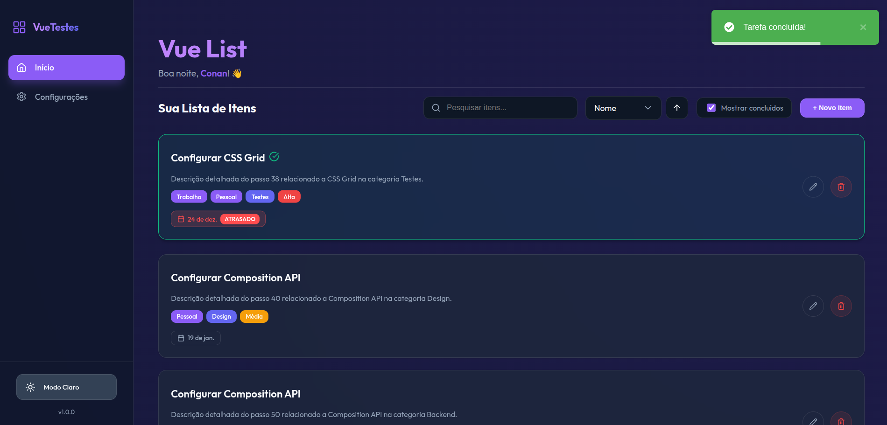
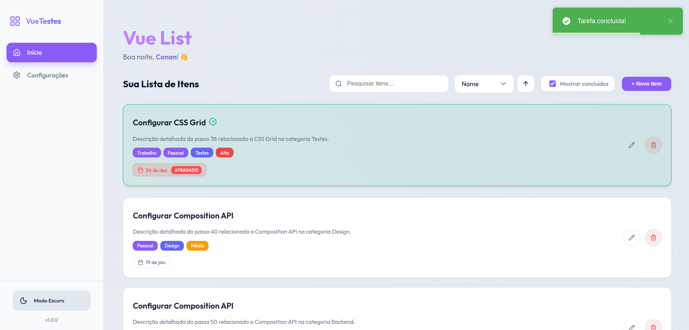

# ✅ TodoListVueJS - Sistema de Gerenciamento de Tarefas

Um sistema completo de gerenciamento de tarefas construído com **Vue 3**, **Express.js** e **MongoDB**. Permite criar, editar, marcar como concluídas e organizar tarefas com busca avançada, paginação e filtros.

## ✨ Funcionalidades

### 📸 Screenshots

### Tema Escuro


### Tema Claro



- ✅ **Criar tarefas** com nome, descrição, categoria, prioridade e tags
- ✅ **Marcar como concluída** clicando na tarefa
- ✅ **Editar tarefas** existentes
- ✅ **Remover tarefas** com confirmação
- ✅ **Datas de vencimento** com indicadores visuais

### 🔍 Busca e Filtros
- 🔍 **Busca em tempo real** por nome e descrição
- 📊 **Ordenação** por nome, data de vencimento, prioridade ou categoria
- 📄 **Paginação** configurável (5, 10 ou 20 itens por página)
- 👁️ **Filtro de tarefas concluídas** (ocultas por padrão)

### 🎨 Personalização
- 🌙 **Tema escuro/claro** com transição suave
- 👤 **Configuração de usuário** (nome personalizado)
- ⚙️ **Preferências salvas** no banco de dados

### 📱 Interface
- 📱 **Design responsivo** para desktop e mobile
- 🎨 **UI moderna** com glassmorphism e animações
- 🔔 **Notificações toast** para feedback
- ⌨️ **Navegação por teclado** e acessibilidade

## 🛠️ Stack Tecnológica

### Frontend
- **Vue 3** (3.5.24) - Framework JavaScript progressivo com Composition API
- **TypeScript** (5.9.3) - Tipagem estática para maior segurança
- **Vite** (7.2.4) - Build tool ultra-rápido e dev server
- **Vue Router** (4.6.4) - Roteamento SPA
- **Pinia** (3.0.4) - Gerenciamento de estado moderno
- **Vue Toastification** (2.0.0-rc.5) - Notificações elegantes
- **Lucide Vue Next** (0.562.0) - Ícones SVG consistentes

### Backend
- **Node.js** - Runtime JavaScript
- **Express.js** (5.2.1) - Framework web minimalista para API REST
- **MongoDB** (7.0.0) - Banco de dados NoSQL escalável
- **CORS** - Suporte a requisições cross-origin

### DevOps & Ferramentas
- **Docker** - Containerização completa
- **Mongo Express** - Interface web para administração do banco

## 📋 Pré-requisitos

- **Node.js** (versão 18+)
- **npm**
- **Docker**

## 🚀 Como Executar o Projeto

### 1️⃣ Clone e instale as dependências
```bash
git clone https://github.com/C0nanT/todo-list-vuejs
cd todo-list-vuejs
npm install
```

### 2️⃣ Inicie a infraestrutura com Docker
```bash
docker compose up -d
```

Isso iniciará automaticamente:
- **MongoDB** na porta `27017`
- **Mongo Express** na porta `8081` (interface web para o banco)

### 3️⃣ Popule o banco de dados
```bash
npm run seed
```

### 4️⃣ Inicie o backend
```bash
npm run server
```

### 5️⃣ Inicie o frontend (em outro terminal)
```bash
npm run dev
```

### 6️⃣ Acesse a aplicação
- **🏠 Frontend:** [http://localhost:5173](http://localhost:5173)
- **🗄️ Mongo Express:** [http://localhost:8081](http://localhost:8081)
  - Usuário: `admin`
  - Senha: `pass`

## 🛑 Como Parar o Projeto

```bash
# Para os containers Docker
docker compose down

# Remove volumes (dados do banco)
docker compose down -v
```

## 📦 Scripts Disponíveis

| Comando | Descrição |
|---------|-----------|
| `npm run dev` | Inicia o servidor de desenvolvimento (frontend) |
| `npm run server` | Inicia o backend Express.js |
| `npm run build` | Cria a build de produção otimizada |
| `npm run seed` | Popula o banco com dados de exemplo |

## 🎨 Temas e Design

O projeto suporta dois temas visuais:

### 🌙 **Tema Escuro** 
- Background gradiente escuro
- Cards com efeito glassmorphism
- Texto claro para boa legibilidade
- Bordas sutis com transparência

### ☀️ **Tema Claro**
- Background gradiente claro
- Contraste otimizado
- Elementos com sombras suaves
- Transições suaves entre temas

## 🤝 Contribuição

1. Fork o projeto
2. Crie uma branch para sua feature (`git checkout -b feature/nova-funcionalidade`)
3. Commit suas mudanças (`git commit -am 'Adiciona nova funcionalidade'`)
4. Push para a branch (`git push origin feature/nova-funcionalidade`)
5. Abra um Pull Request
